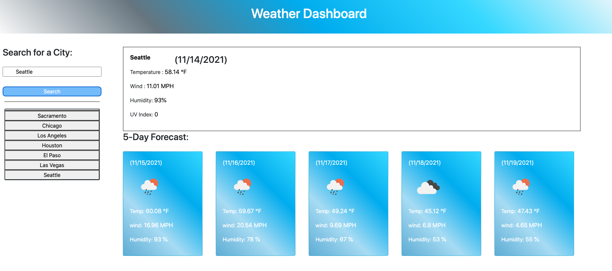
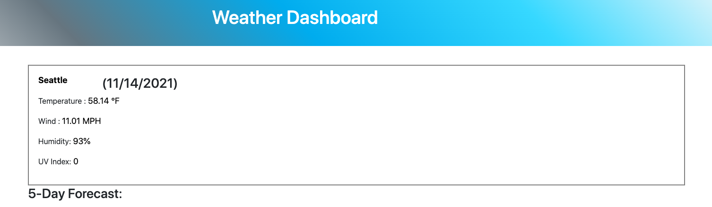
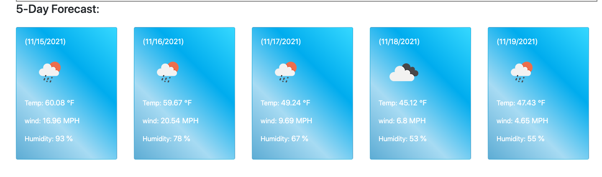

# Weather Application using Third Party API's

## Project Description

Building an a web based application that helps on providing accurate information about wether conditions in mutiple Citites
Creating a We b application that enables user to enter a city.
Being able to search the city current day's wether is displayed allong with the forecast for the next five days.
The list that have bee searched will be avillable on the drop the screen and once clicked it will provid ethe infomation for that particular city.

* Main Landing Page

* Current day view

* Forecast for the next Five days

